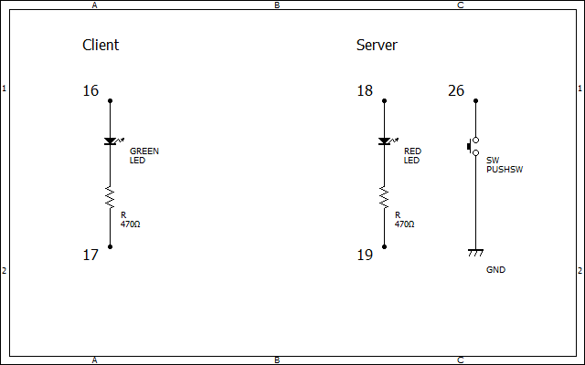

# M5 server

## 概要 (Overview)

M5StackシリーズでWebサーバーを構築し、ブラウザ及びM5Stackを制御します。

- WebUI上で監視のON/OFFを切り替え
- ON時にスイッチ押下でクライアントへ通知

## 画面イメージ (ScreenShot)
https://www.youtube.com/watch?v=yMdpIotfWmc

## 動作要件 (Requirements)

C/C++ / M5Stack

## 技術的解説 (Technical explanation)

## 回路図 (Schematic)

## ライセンス (License)

This software is released under the MIT License, see LICENSE.
